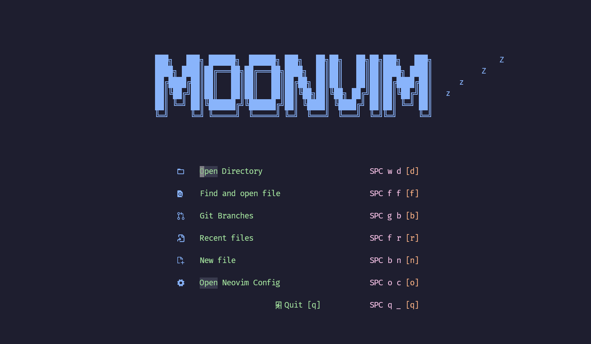
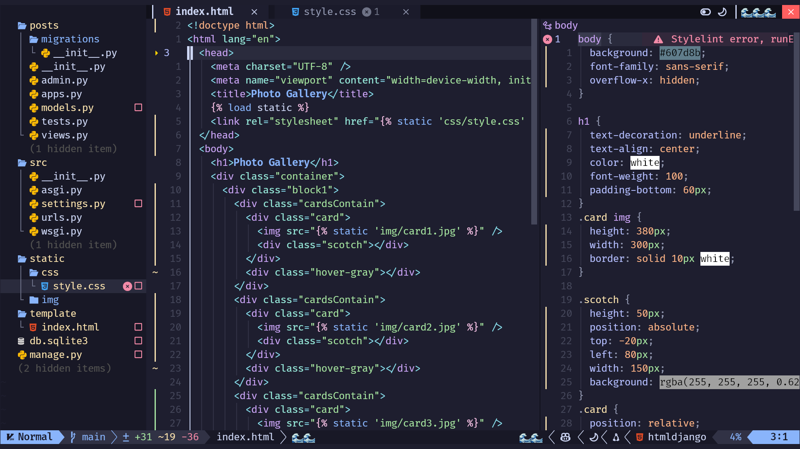
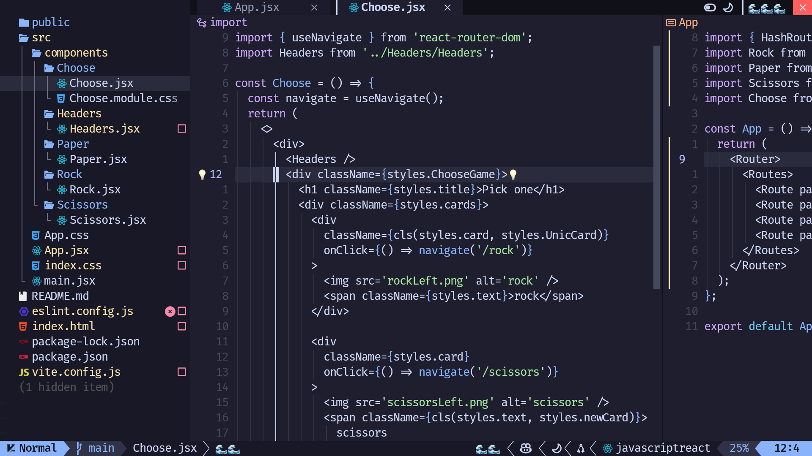
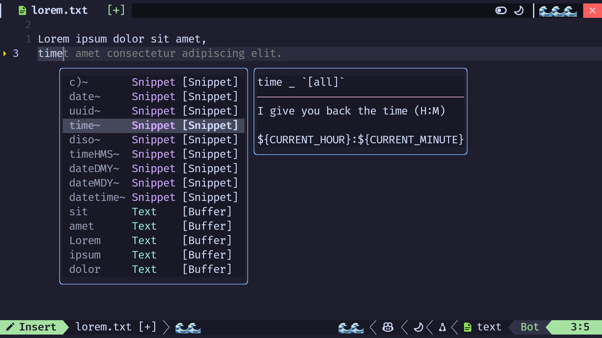

# nvim-maaru






# install

```bash
#save bak version
mv ~/.config/nvim ~/.config/nvim.bak
#cloning my nvim
git clone https://github.com/maarutan/moonvim.git ~/.config/nvim
#remove .git
rm -rf ~/.config/nvim/.git
```
